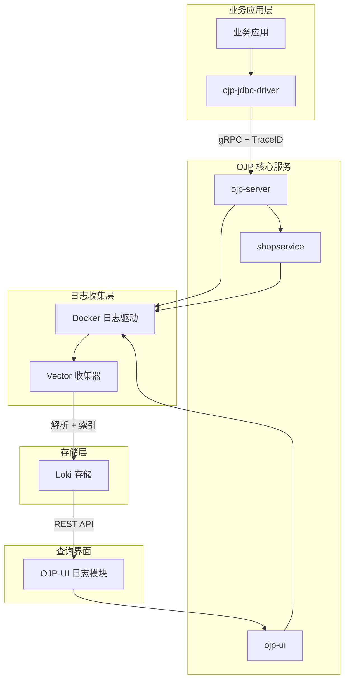
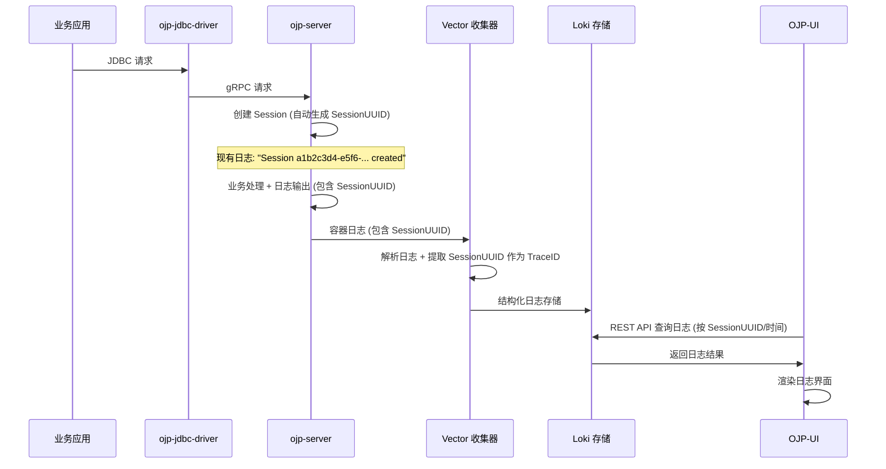

# 设计文档

## 概述

本文档描述了为 OJP (Open JDBC Proxy) 项目设计的轻量级日志收集和链路追踪系统。该系统基于 Vector + Loki 技术栈，通过无侵入的方式实现日志集中收集、TraceID 链路追踪，并将查询界面完全集成到 ojp-ui 中。

## 架构

### 整体架构图



### 数据流架构



## 组件和接口

### 1. 完全无侵入的 TraceID 方案

#### 基于现有 SessionUUID 的链路追踪
OJP 已经具备完善的会话管理机制，每个 JDBC 连接都有唯一的 `sessionUUID`。我们可以直接利用这个现有标识符作为 TraceID，实现零代码侵入的链路追踪。

```java
// 现有代码已经在日志中输出 sessionUUID，无需修改
log.info("Create session for client uuid {} readOnly: {}", clientUUID, readOnly);
log.info("Session " + session.getSessionUUID() + " created for client uuid " + clientUUID);
```

#### 无侵入实现原理
1. **利用现有 SessionUUID**: 直接使用 OJP 现有的 `session.getSessionUUID()` 作为 TraceID
2. **日志自动包含**: 现有日志已经包含 sessionUUID，无需添加任何代码
3. **Vector 自动提取**: 通过日志解析自动提取 sessionUUID 作为 trace_id
4. **完全透明**: 对现有代码零影响，完全透明的链路追踪

#### 日志规范化增强
为了更好地支持链路追踪和问题排查，建议对现有日志进行规范化改进：

```java
// 建议新增：统一的日志工具类
@Component
public class OjpLogger {
    
    /**
     * 记录会话相关日志
     */
    public static void logSession(Logger logger, String sessionUUID, String action, Object... params) {
        logger.info("会话[{}] {} {}", sessionUUID, action, formatParams(params));
    }
    
    /**
     * 记录数据库操作日志
     */
    public static void logDatabase(Logger logger, String sessionUUID, String operation, String target, long timeMs) {
        logger.info("会话[{}] 数据库操作 {} 目标:{} 耗时:{}ms", sessionUUID, operation, target, timeMs);
    }
    
    /**
     * 记录缓存决策日志
     */
    public static void logCacheDecision(Logger logger, String sessionUUID, String decision, String table, String reason) {
        logger.info("会话[{}] 缓存决策 {} 表:{} 原因:{}", sessionUUID, decision, table, reason);
    }
    
    /**
     * 记录慢查询日志
     */
    public static void logSlowQuery(Logger logger, String sessionUUID, String sql, long timeMs) {
        logger.warn("会话[{}] 慢查询检测 SQL:{} 耗时:{}ms", sessionUUID, abbreviate(sql, 100), timeMs);
    }
    
    /**
     * 记录异常日志
     */
    public static void logError(Logger logger, String sessionUUID, String operation, Exception e) {
        logger.error("会话[{}] 操作异常 {} 错误:{}", sessionUUID, operation, e.getMessage(), e);
    }
    
    private static String formatParams(Object... params) {
        if (params == null || params.length == 0) return "";
        return Arrays.stream(params).map(String::valueOf).collect(Collectors.joining(" "));
    }
    
    private static String abbreviate(String str, int maxLength) {
        return str.length() > maxLength ? str.substring(0, maxLength) + "..." : str;
    }
}
```

#### 规范化后的日志示例
```java
// 原有代码改进示例
public class SessionManagerImpl {
    
    @Override
    public SessionInfo createSession(String clientUUID, Connection connection, boolean readOnly) {
        Session session = new Session(connection, connectionHashMap.get(clientUUID), clientUUID, readOnly);
        
        // 规范化日志：使用中文，包含 SessionUUID
        OjpLogger.logSession(log, session.getSessionUUID(), "创建会话", 
            "客户端:" + clientUUID, "只读:" + readOnly);
        
        this.sessionMap.put(session.getSessionUUID(), session);
        return session.getSessionInfo();
    }
    
    @Override
    public void terminateSession(SessionInfo sessionInfo) throws SQLException {
        OjpLogger.logSession(log, sessionInfo.getSessionUUID(), "终止会话");
        // ... 现有逻辑
    }
}
```

### 2. 日志收集组件 (Vector)

#### Vector 配置文件 - 支持中文日志解析
```toml
# vector.toml
[sources.docker_logs]
type = "docker_logs"
include_containers = ["ojp-server", "shopservice", "ojp-ui"]
exclude_containers = ["vector", "loki"]

[transforms.parse_logs]
type = "remap"
inputs = ["docker_logs"]
source = '''
# 解析时间戳
.timestamp = parse_timestamp(.timestamp, "%Y-%m-%dT%H:%M:%S%.fZ") ?? now()

# 解析日志级别
if match(.message, r"(DEBUG|INFO|WARN|ERROR)") {
  .level = capture(.message, r"(DEBUG|INFO|WARN|ERROR)")[0]
} else {
  .level = "INFO"
}

# 提取 SessionUUID 作为 TraceID (支持中文日志格式)
# 匹配格式: "会话[a1b2c3d4-e5f6-7890-1234-567890abcdef] 创建会话"
if match(.message, r"会话\[([a-f0-9-]{36})\]") {
  .trace_id = capture(.message, r"会话\[([a-f0-9-]{36})\]")[0]
}

# 兼容现有英文格式
if match(.message, r"Session ([a-f0-9-]{36})") {
  .trace_id = capture(.message, r"Session ([a-f0-9-]{36})")[0]
}

if match(.message, r"session -> ([a-f0-9-]{36})") {
  .trace_id = capture(.message, r"session -> ([a-f0-9-]{36})")[0]
}

if match(.message, r"for session ([a-f0-9-]{36})") {
  .trace_id = capture(.message, r"for session ([a-f0-9-]{36})")[0]
}

if match(.message, r"client uuid ([a-f0-9-]{36})") {
  .trace_id = capture(.message, r"client uuid ([a-f0-9-]{36})")[0]
}

# 解析服务名
.service = .container_name

# 解析日志内容 (移除时间戳前缀)
if match(.message, r"\d{4}-\d{2}-\d{2} \d{2}:\d{2}:\d{2}\.\d{3} .* - (.*)") {
  .content = capture(.message, r"\d{4}-\d{2}-\d{2} \d{2}:\d{2}:\d{2}\.\d{3} .* - (.*)")[0]
} else {
  .content = .message
}

# 检测慢查询 (支持中文)
if match(.content, r"慢查询|slow|timeout|耗时.*ms") {
  .is_slow_query = true
  # 提取执行时间
  if match(.content, r"耗时:(\d+)ms") {
    .execution_time = to_int(capture(.content, r"耗时:(\d+)ms")[0])
  } else if match(.content, r"(\d+)ms") {
    .execution_time = to_int(capture(.content, r"(\d+)ms")[0])
  }
}

# 检测缓存决策 (支持中文)
if match(.content, r"缓存决策|cache|Cache|routing|decision") {
  .is_cache_decision = true
  # 提取决策结果
  if match(.content, r"缓存决策 (命中|未命中|跳过)") {
    .cache_result = capture(.content, r"缓存决策 (命中|未命中|跳过)")[0]
  }
}

# 检测数据库操作 (支持中文)
if match(.content, r"数据库操作|MySQL|StarRocks|connection|query") {
  .is_db_operation = true
  # 提取操作类型和目标
  if match(.content, r"数据库操作 (\w+) 目标:(\w+)") {
    .db_operation = capture(.content, r"数据库操作 (\w+) 目标:(\w+)")[0]
    .db_target = capture(.content, r"数据库操作 (\w+) 目标:(\w+)")[1]
  }
}

# 检测会话操作 (支持中文)
if match(.content, r"创建会话|终止会话|会话操作") {
  .is_session_operation = true
}
'''

[sinks.loki]
type = "loki"
inputs = ["parse_logs"]
endpoint = "http://loki:3100"
labels.container_name = "{{ container_name }}"
labels.level = "{{ level }}"
labels.service = "{{ service }}"

# 健康检查
[sinks.healthcheck]
type = "console"
inputs = ["parse_logs"]
target = "stderr"
encoding.codec = "json"
healthcheck.enabled = true
```

### 3. 日志存储组件 (Loki)

#### Loki 配置文件
```yaml
# loki-config.yaml
auth_enabled: false

server:
  http_listen_port: 3100
  grpc_listen_port: 9096

common:
  path_prefix: /loki
  storage:
    filesystem:
      chunks_directory: /loki/chunks
      rules_directory: /loki/rules
  replication_factor: 1
  ring:
    instance_addr: 127.0.0.1
    kvstore:
      store: inmemory

schema_config:
  configs:
    - from: 2020-10-24
      store: boltdb-shipper
      object_store: filesystem
      schema: v11
      index:
        prefix: index_
        period: 24h

storage_config:
  boltdb_shipper:
    active_index_directory: /loki/boltdb-shipper-active
    cache_location: /loki/boltdb-shipper-cache
    shared_store: filesystem
  filesystem:
    directory: /loki/chunks

limits_config:
  retention_period: 168h  # 7天保留期
  ingestion_rate_mb: 16   # 16MB/s 摄入限制
  ingestion_burst_size_mb: 32
  max_query_parallelism: 32
  max_streams_per_user: 10000
  max_line_size: 256KB

chunk_store_config:
  max_look_back_period: 168h

table_manager:
  retention_deletes_enabled: true
  retention_period: 168h

compactor:
  working_directory: /loki/boltdb-shipper-compactor
  shared_store: filesystem
```

### 4. UI 集成组件

#### Loki API 代理配置
```javascript
// vite.config.js 添加 Loki 代理
export default defineConfig({
  // ... 现有配置
  server: {
    // ... 现有代理配置
    proxy: {
      '/api': {
        target: 'http://localhost:8010',
        changeOrigin: true,
        secure: false,
      },
      // 新增 Loki 代理
      '/api/loki': {
        target: 'http://localhost:3100',
        changeOrigin: true,
        secure: false,
        rewrite: (path) => path.replace(/^\/api\/loki/, '')
      }
    }
  }
})
```

#### Loki API 服务封装
```javascript
// src/services/lokiApi.js
const LOKI_BASE_URL = '/api/loki'

export const lokiApi = {
  // 查询日志范围
  queryRange: async (query, start, end) => {
    const params = new URLSearchParams({
      query,
      start: start.toString() + '000000', // 转换为纳秒
      end: end.toString() + '000000'
    })
    
    const response = await fetch(`${LOKI_BASE_URL}/loki/api/v1/query_range?${params}`)
    if (!response.ok) {
      throw new Error(`Loki query failed: ${response.status}`)
    }
    return response.json()
  },
  
  // 获取标签值
  getLabelValues: async (label) => {
    const response = await fetch(`${LOKI_BASE_URL}/loki/api/v1/label/${label}/values`)
    if (!response.ok) {
      throw new Error(`Get label values failed: ${response.status}`)
    }
    return response.json()
  },
  
  // 健康检查
  healthCheck: async () => {
    try {
      const response = await fetch(`${LOKI_BASE_URL}/ready`)
      return response.ok
    } catch {
      return false
    }
  }
}
```

#### React 日志查询组件
```javascript
// src/components/LogExplorer.jsx
import React, { useState, useEffect } from 'react'
import { Card, Input, Select, Table, Tag, Space, DatePicker, Button, Alert } from 'antd'
import { SearchOutlined, ReloadOutlined, ExclamationCircleOutlined } from '@ant-design/icons'
import { lokiApi } from '../services/lokiApi'

const { RangePicker } = DatePicker
const { Option } = Select

const LogExplorer = () => {
  const [logs, setLogs] = useState([])
  const [loading, setLoading] = useState(false)
  const [traceId, setTraceId] = useState('')
  const [service, setService] = useState('all')
  const [level, setLevel] = useState('all')
  const [timeRange, setTimeRange] = useState([])
  const [lokiHealth, setLokiHealth] = useState(true)

  // 检查 Loki 健康状态
  useEffect(() => {
    const checkHealth = async () => {
      const healthy = await lokiApi.healthCheck()
      setLokiHealth(healthy)
    }
    checkHealth()
    const interval = setInterval(checkHealth, 30000) // 每30秒检查一次
    return () => clearInterval(interval)
  }, [])

  const searchLogs = async () => {
    if (!lokiHealth) {
      message.error('日志服务不可用，请稍后重试')
      return
    }
    
    setLoading(true)
    try {
      const query = buildLokiQuery()
      const start = getStartTime()
      const end = getEndTime()
      
      const data = await lokiApi.queryRange(query, start, end)
      const formattedLogs = formatLokiResponse(data)
      setLogs(formattedLogs)
    } catch (error) {
      console.error('查询日志失败:', error)
      message.error('查询日志失败: ' + error.message)
    } finally {
      setLoading(false)
    }
  }

  const buildLokiQuery = () => {
    let query = '{'
    
    // 服务过滤
    if (service !== 'all') {
      query += `service="${service}"`
    } else {
      query += 'service=~"ojp-.*|shopservice"'
    }
    
    // 日志级别过滤
    if (level !== 'all') {
      query += `,level="${level}"`
    }
    
    query += '}'
    
    // TraceID 过滤
    if (traceId) {
      query += ` |= "${traceId}"`
    }
    
    return query
  }

  const formatLokiResponse = (data) => {
    const logs = []
    if (data.data && data.data.result) {
      data.data.result.forEach(stream => {
        stream.values.forEach(([timestamp, message]) => {
          logs.push({
            key: `${timestamp}-${Math.random()}`,
            timestamp: new Date(parseInt(timestamp) / 1000000),
            message,
            service: stream.stream.service,
            level: stream.stream.level,
            traceId: extractTraceId(message)
          })
        })
      })
    }
    return logs.sort((a, b) => b.timestamp - a.timestamp)
  }

  const extractTraceId = (message) => {
    // 提取 SessionUUID 作为 TraceID
    const patterns = [
      /Session ([a-f0-9-]{36})/,
      /session -> ([a-f0-9-]{36})/,
      /for session ([a-f0-9-]{36})/,
      /client uuid ([a-f0-9-]{36})/
    ]
    
    for (const pattern of patterns) {
      const match = message.match(pattern)
      if (match) return match[1]
    }
    return null
  }

  const columns = [
    {
      title: '时间',
      dataIndex: 'timestamp',
      key: 'timestamp',
      width: 180,
      render: (timestamp) => timestamp.toLocaleString()
    },
    {
      title: '服务',
      dataIndex: 'service',
      key: 'service',
      width: 120,
      render: (service) => <Tag color="blue">{service}</Tag>
    },
    {
      title: '级别',
      dataIndex: 'level',
      key: 'level',
      width: 80,
      render: (level) => {
        const color = {
          ERROR: 'red',
          WARN: 'orange',
          INFO: 'green',
          DEBUG: 'gray'
        }[level] || 'default'
        return <Tag color={color}>{level}</Tag>
      }
    },
    {
      title: 'SessionUUID',
      dataIndex: 'traceId',
      key: 'traceId',
      width: 120,
      render: (traceId) => traceId ? (
        <Tag 
          color="purple" 
          style={{ cursor: 'pointer' }}
          onClick={() => setTraceId(traceId)}
        >
          {traceId.substring(0, 8)}...
        </Tag>
      ) : null
    },
    {
      title: '日志内容',
      dataIndex: 'message',
      key: 'message',
      ellipsis: true,
      render: (message) => (
        <div style={{ maxWidth: 600, wordBreak: 'break-all' }}>
          {message}
        </div>
      )
    }
  ]

  return (
    <Card title="日志查询" extra={
      <Space>
        {!lokiHealth && (
          <Alert
            message="日志服务离线"
            type="warning"
            icon={<ExclamationCircleOutlined />}
            showIcon
            size="small"
          />
        )}
        <Button 
          icon={<ReloadOutlined />} 
          onClick={searchLogs}
          loading={loading}
          disabled={!lokiHealth}
        >
          刷新
        </Button>
      </Space>
    }>
      <Space direction="vertical" style={{ width: '100%' }}>
        <Space wrap>
          <Input.Search
            placeholder="输入 SessionUUID"
            value={traceId}
            onChange={(e) => setTraceId(e.target.value)}
            onSearch={searchLogs}
            style={{ width: 300 }}
            enterButton={<SearchOutlined />}
          />
          
          <Select
            value={service}
            onChange={setService}
            style={{ width: 150 }}
          >
            <Option value="all">所有服务</Option>
            <Option value="ojp-server">OJP Server</Option>
            <Option value="shopservice">Shop Service</Option>
            <Option value="ojp-ui">OJP UI</Option>
          </Select>
          
          <Select
            value={level}
            onChange={setLevel}
            style={{ width: 120 }}
          >
            <Option value="all">所有级别</Option>
            <Option value="ERROR">ERROR</Option>
            <Option value="WARN">WARN</Option>
            <Option value="INFO">INFO</Option>
            <Option value="DEBUG">DEBUG</Option>
          </Select>
          
          <RangePicker
            showTime
            value={timeRange}
            onChange={setTimeRange}
            style={{ width: 350 }}
          />
        </Space>
        
        <Table
          columns={columns}
          dataSource={logs}
          loading={loading}
          pagination={{
            pageSize: 50,
            showSizeChanger: true,
            showQuickJumper: true,
            showTotal: (total) => `共 ${total} 条日志`
          }}
          scroll={{ x: 1200 }}
          size="small"
        />
      </Space>
    </Card>
  )
}

export default LogExplorer
```

## 部署配置

### Docker Compose 配置
```yaml
# docker-compose-logging.yml
version: '3.8'

networks:
  a8:
    external: true

volumes:
  loki-data:
    driver: local

services:
  # 日志收集器
  vector:
    image: timberio/vector:0.34.0-alpine
    container_name: ojp-vector
    volumes:
      - /var/run/docker.sock:/var/run/docker.sock:ro
      - ./vector/vector.toml:/etc/vector/vector.toml:ro
    networks:
      a8:
        ipv4_address: 172.24.0.51
    restart: unless-stopped
    depends_on:
      - loki
    healthcheck:
      test: ["CMD", "vector", "validate", "/etc/vector/vector.toml"]
      interval: 30s
      timeout: 10s
      retries: 3

  # 日志存储
  loki:
    image: grafana/loki:2.9.0
    container_name: ojp-loki
    command: -config.file=/etc/loki/local-config.yaml
    volumes:
      - ./loki/loki-config.yaml:/etc/loki/local-config.yaml:ro
      - loki-data:/loki
    networks:
      a8:
        ipv4_address: 172.24.0.50
    restart: unless-stopped
    healthcheck:
      test: ["CMD-SHELL", "wget --no-verbose --tries=1 --spider http://localhost:3100/ready || exit 1"]
      interval: 30s
      timeout: 10s
      retries: 3
    environment:
      - JAEGER_AGENT_HOST=
      - JAEGER_ENDPOINT=
      - JAEGER_SAMPLER_TYPE=
      - JAEGER_SAMPLER_PARAM=
```

### 启动脚本
```bash
#!/bin/bash
# start-logging.sh

echo "启动 OJP 日志收集系统..."

# 创建配置目录
mkdir -p vector loki

# 检查网络
if ! docker network ls | grep -q "a8"; then
    echo "错误: 请先启动 OJP 主服务以创建 a8 网络"
    exit 1
fi

# 启动日志服务
docker-compose -f docker-compose-logging.yml up -d

echo "等待服务启动..."
sleep 10

# 健康检查
echo "检查服务状态..."
docker-compose -f docker-compose-logging.yml ps

echo "日志收集系统启动完成！"
echo "- Loki API: http://localhost:3100"
echo "- 日志查询: 通过 OJP-UI 访问"
```

## 数据模型

### 日志数据结构
```json
{
  "timestamp": "2024-01-15T10:30:45.123Z",
  "level": "INFO",
  "service": "ojp-server",
  "trace_id": "a1b2c3d4-e5f6-7890-1234-567890abcdef",
  "content": "会话[a1b2c3d4-e5f6-7890-1234-567890abcdef] 创建会话 客户端:b2c3d4e5-f6g7-8901-2345-678901234bcd 只读:false",
  "container_name": "ojp-server",
  "is_slow_query": false,
  "is_cache_decision": false,
  "is_db_operation": false,
  "is_session_operation": true,
  "execution_time": null
}
```

### TraceID 格式规范 (基于现有 SessionUUID)
- **格式**: 标准 UUID 格式 (36位，包含连字符)
- **示例**: `a1b2c3d4-e5f6-7890-1234-567890abcdef`
- **来源**: OJP 现有的 `session.getSessionUUID()`
- **提取**: Vector 从现有日志中自动提取 SessionUUID
- **优势**: 完全无侵入，利用现有会话管理机制

## 正确性属性

*属性是一个特征或行为，应该在系统的所有有效执行中保持为真——本质上是关于系统应该做什么的正式声明。属性作为人类可读规范和机器可验证正确性保证之间的桥梁。*

### 属性 1: 容器日志自动发现
*对于任何* 新启动或重启的 OJP 相关容器，日志收集器应该在 30 秒内自动发现并开始收集其日志
**验证: 需求 1.3**

### 属性 2: 日志保留期管理
*对于任何* 超过 7 天的历史日志，当存储空间不足时，系统应该自动删除这些日志
**验证: 需求 1.4, 3.3**

### 属性 3: SessionUUID 唯一性和一致性
*对于任何* JDBC 会话，生成的 SessionUUID 应该是唯一的，并且在整个会话生命周期中保持一致
**验证: 需求 2.1, 2.2, 2.3**

### 属性 4: 异常日志 SessionUUID 关联
*对于任何* 系统异常，相关的错误日志应该包含对应会话的 SessionUUID
**验证: 需求 2.5**

### 属性 5: 资源使用限制
*对于任何* 系统运行状态，日志存储组件的内存使用应该不超过 512MB
**验证: 需求 3.1**

### 属性 6: 查询性能保证
*对于任何* 最近 1 小时范围内的日志查询，系统应该在 3 秒内返回结果
**验证: 需求 3.2**

### 属性 7: 并发查询支持
*对于任何* 并发查询场景，系统应该能够同时处理至少 10 个查询请求
**验证: 需求 3.4**

### 属性 8: 日志缓冲不丢失
*对于任何* 高速日志写入场景，系统应该通过缓冲机制保证不丢失任何日志
**验证: 需求 3.5**

### 属性 9: SessionUUID 查询完整性
*对于任何* 有效的 SessionUUID，查询应该返回该会话的所有相关日志
**验证: 需求 4.2**

### 属性 10: 时间范围查询准确性
*对于任何* 指定的时间范围，查询应该只返回该时间段内的日志
**验证: 需求 4.3**

### 属性 11: 错误日志高亮显示
*对于任何* ERROR 级别的日志，UI 界面应该高亮显示这些日志
**验证: 需求 4.5**

### 属性 12: 慢查询日志记录
*对于任何* 执行时间超过阈值的查询，日志应该记录执行时间和 SQL 语句
**验证: 需求 5.1**

### 属性 13: 缓存决策日志记录
*对于任何* 缓存路由决策，日志应该记录决策过程和结果
**验证: 需求 5.2**

### 属性 14: 配置热重载
*对于任何* 日志配置文件的修改，系统应该能够在不重启的情况下重新加载配置
**验证: 需求 6.2**

### 属性 15: 自适应采集频率
*对于任何* 系统资源紧张的情况，日志收集器应该自动降低采集频率以减少资源消耗
**验证: 需求 6.3**

### 属性 16: 日志格式统一性
*对于任何* 系统日志输出，都应该包含统一格式的 SessionUUID 标识
**验证: 需求 7.1**

### 属性 17: 中文日志可读性
*对于任何* 会话操作、数据库操作和缓存决策，日志应该使用中文描述便于理解
**验证: 需求 7.2, 7.3, 7.4**

### 属性 18: 异常日志完整性
*对于任何* 系统异常，错误日志应该包含 SessionUUID、操作描述和详细错误信息
**验证: 需求 7.5**

## 错误处理

### 1. 日志收集器异常处理
- **连接失败**: 自动重试机制，指数退避策略
- **解析错误**: 记录原始日志，继续处理其他日志
- **存储失败**: 本地缓存，待存储恢复后重新发送

### 2. TraceID 传递异常处理
- **生成失败**: 使用时间戳 + 随机数作为备用方案
- **传递失败**: 记录警告日志，不影响业务处理
- **解析失败**: 使用默认 TraceID 格式

### 3. 查询服务异常处理
- **Loki 不可用**: 返回友好错误信息，建议稍后重试
- **查询超时**: 自动取消查询，提示缩小查询范围
- **结果过大**: 分页返回，限制单次查询结果数量

### 4. 存储空间异常处理
- **磁盘满**: 自动清理最旧的日志，发送告警通知
- **写入失败**: 启用压缩，减少存储空间占用
- **索引损坏**: 自动重建索引，临时降级为全文搜索

## 测试策略

### 单元测试
- **TraceID 生成器**: 测试唯一性、格式正确性
- **日志解析器**: 测试各种日志格式的解析准确性
- **查询构建器**: 测试 Loki 查询语句的正确性
- **UI 组件**: 测试用户交互和数据展示

### 集成测试
- **端到端链路**: 从 JDBC 请求到日志查询的完整流程
- **容器发现**: 测试新容器启动时的自动发现机制
- **故障恢复**: 测试各组件异常时的恢复能力
- **性能基准**: 测试查询响应时间和并发处理能力

### 属性测试
- **SessionUUID 一致性**: 验证同一会话的所有日志包含相同 SessionUUID
- **日志完整性**: 验证高并发场景下日志不丢失
- **查询准确性**: 验证时间范围和 SessionUUID 查询的准确性
- **资源限制**: 验证内存和存储使用不超过限制
- **中文日志解析**: 验证 Vector 能正确解析中文日志内容
- **日志格式统一**: 验证所有日志都遵循统一的格式规范

### 性能测试
- **日志摄入速度**: 测试每秒处理的日志条数
- **查询响应时间**: 测试不同查询条件下的响应时间
- **并发查询**: 测试多用户同时查询的性能
- **存储效率**: 测试日志压缩和索引效率