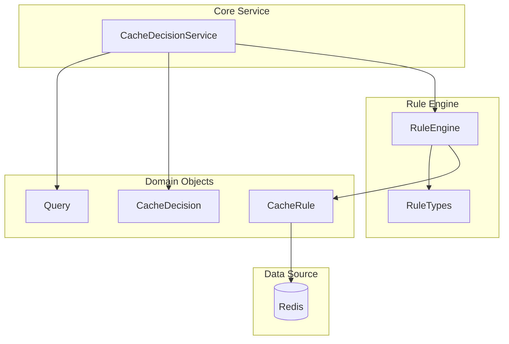

# CacheDecisionService 精简设计文档

## 1. 设计概述

### 1.1 核心目标
创建一个精简的 `CacheDecisionService` 服务类，根据传入的SQL语句和相关规则，决策是否需要走缓存。

### 1.2 设计原则
- **单一职责**：只负责缓存决策逻辑
- **简单高效**：避免过度设计，专注核心功能
- **易于集成**：可以被其他服务直接调用
- **规则驱动**：基于配置的规则进行决策

## 2. 核心架构

### 2.1 简化架构图



### 2.2 组件说明
- **CacheDecisionService**: 核心服务类，提供缓存决策功能
- **Query**: 查询对象，封装SQL和表信息
- **CacheDecision**: 决策结果对象
- **RuleEngine**: 规则引擎，负责规则匹配
- **CacheRule**: 缓存规则实体

## 3. 核心类设计

### 3.1 CacheDecisionService 接口

```java
/**
 * 缓存决策服务
 * 根据SQL查询和规则配置，决定是否使用缓存
 */
public interface CacheDecisionService {
    
    /**
     * 根据SQL和JDBC URL判断是否使用缓存
     * @param sql SQL语句
     * @param jdbcUrl JDBC连接URL，用于提取数据库名称
     * @return 缓存决策结果
     */
    CacheDecision shouldUseCache(String sql, String jdbcUrl);
    
    /**
     * 刷新规则缓存
     */
    void refreshRules();
}```

### 3.2 实现要求

#### 3.2.1 核心实现逻辑
- **JDBC URL解析**: 从jdbcUrl中提取数据库名称，支持常见的JDBC URL格式
- **SQL解析**: 自动从SQL语句中提取涉及的表名集合
- **规则匹配**: 根据数据库名称加载对应的缓存规则，按优先级进行匹配
- **决策生成**: 返回包含缓存策略、TTL、匹配规则等信息的决策结果

#### 3.2.2 异常处理
- JDBC URL解析失败时，记录警告日志并返回不缓存决策
- SQL解析异常时，记录错误信息并返回不缓存决策
- 规则匹配过程中的异常，采用降级策略返回不缓存决策

#### 3.2.3 性能要求
- 单次决策响应时间 < 5ms
- 支持高并发调用
- 规则缓存命中率 > 95%

### 3.3 领域对象设计

#### 3.3.1 Query 查询对象

**字段定义**:
- `sql`: SQL语句
- `tables`: 从SQL中解析出的表名集合
- `databaseName`: 从JDBC URL中提取的数据库名称
- `queryId`: SQL语句的MD5哈希值，用于唯一标识查询

**构造要求**:
- 支持通过SQL和JDBC URL构造
- 自动解析表名和数据库名称
- 生成唯一的查询标识符

#### 3.3.2 CacheDecision 决策结果

**字段定义**:
- `useCache`: 是否使用缓存的布尔值
- `reason`: 决策原因说明
- `ruleId`: 匹配的规则ID（如果有）
- `ttl`: 缓存过期时间（秒）
- `timestamp`: 决策时间戳

**工厂方法要求**:
- 提供 `cache()` 静态方法创建缓存决策
- 提供 `noCache()` 静态方法创建不缓存决策
- 自动设置决策时间戳

#### 3.3.3 CacheRule 缓存规则

**基本字段**:
- `id`: 规则唯一标识
- `name`: 规则名称
- `description`: 规则描述
- `databaseName`: 所属数据库名称
- `priority`: 优先级（数值越大优先级越高）
- `ttl`: 缓存过期时间（秒）
- `enabled`: 是否启用

**规则条件字段**:
- `tables`: 精确表名匹配（逗号分隔）
- `tablesAny`: 任意表名匹配（逗号分隔）
- `tablesAll`: 全部表名匹配（逗号分隔）
- `regex`: SQL正则表达式匹配
- `queryIds`: 查询ID匹配（逗号分隔）

**时间字段**:
- `createdAt`: 创建时间
- `updatedAt`: 更新时间

## 4. 规则引擎设计

### 4.1 RuleEngine 规则引擎

#### 4.1.1 核心职责
- **规则加载**: 从Redis中加载指定数据库的缓存规则
- **规则匹配**: 根据查询对象匹配最合适的缓存规则
- **规则缓存**: 在内存中缓存规则，提高匹配性能
- **规则刷新**: 支持手动刷新规则缓存

#### 4.1.2 匹配策略
1. **数据库过滤**: 只匹配当前数据库的规则
2. **优先级排序**: 按规则优先级降序排列
3. **条件匹配**: 支持以下匹配类型
   - 精确表名匹配：查询涉及的表名完全匹配规则中的表名
   - 任意表名匹配：查询涉及的表名中任意一个匹配规则中的表名
   - 全部表名匹配：查询涉及的表名包含规则中的所有表名
   - 正则表达式匹配：SQL语句匹配规则中的正则表达式
   - 查询ID匹配：查询ID匹配规则中指定的查询ID列表
4. **首次匹配**: 找到第一个匹配的规则即停止搜索

#### 4.1.3 性能优化
- 使用读写锁保护规则缓存，支持高并发读取
- 规则按数据库分组缓存，减少匹配范围
- 异常规则自动跳过，避免影响整体性能

#### 4.1.4 接口定义
- `findMatchingRule(Query query)`: 查找匹配的规则
- `refreshRules()`: 刷新规则缓存
- `getRuleCount(String databaseName)`: 获取指定数据库的规则数量

## 5. SQL解析器设计

### 5.1 SqlParser SQL解析器

```java
/**
 * SQL解析器，提取SQL中的表名
 */
@Component
@Slf4j
public class SqlParser {
    
    // 简单的表名提取正则表达式
    private static final Pattern FROM_PATTERN = Pattern.compile(
        "\\bFROM\\s+([\\w\\.`]+)(?:\\s+(?:AS\\s+)?\\w+)?", 
        Pattern.CASE_INSENSITIVE
    );
    
    private static final Pattern JOIN_PATTERN = Pattern.compile(
        "\\b(?:INNER\\s+|LEFT\\s+|RIGHT\\s+|FULL\\s+)?JOIN\\s+([\\w\\.`]+)(?:\\s+(?:AS\\s+)?\\w+)?", 
        Pattern.CASE_INSENSITIVE
    );
    
    /**
     * 从SQL中提取表名
     */
    public Set<String> extractTables(String sql) {
        if (StringUtils.isEmpty(sql)) {
            return Collections.emptySet();
        }
        
        Set<String> tables = new HashSet<>();
        
        try {
            // 提取FROM子句中的表名
            Matcher fromMatcher = FROM_PATTERN.matcher(sql);
            while (fromMatcher.find()) {
                String tableName = cleanTableName(fromMatcher.group(1));
                tables.add(tableName);
            }
            
            // 提取JOIN子句中的表名
            Matcher joinMatcher = JOIN_PATTERN.matcher(sql);
            while (joinMatcher.find()) {
                String tableName = cleanTableName(joinMatcher.group(1));
                tables.add(tableName);
            }
            
        } catch (Exception e) {
            log.warn("Failed to extract tables from SQL: {}", sql, e);
        }
        
        return tables;
    }
    
    private String cleanTableName(String tableName) {
        // 移除反引号和模式名
        return tableName.replaceAll("`", "")
            .replaceAll("^\\w+\\.", "") // 移除schema前缀
            .toLowerCase();
    }
}
```

## 6. 配置和集成

### 6.1 Spring配置

```java
@Configuration
@EnableConfigurationProperties
public class CacheDecisionConfig {
    
    @Bean
    public CacheDecisionService cacheDecisionService(
            RuleEngine ruleEngine, 
            SqlParser sqlParser) {
        return new CacheDecisionServiceImpl(ruleEngine, sqlParser);
    }
    
    @Bean
    public RuleEngine ruleEngine(RedisTemplate<String, Object> redisTemplate) {
        return new RuleEngine(redisTemplate);
    }
    
    @Bean
    public SqlParser sqlParser() {
        return new SqlParser();
    }
}
```

### 6.2 使用示例

```java
@Service
public class QueryService {
    
    private final CacheDecisionService cacheDecisionService;
    
    public QueryService(CacheDecisionService cacheDecisionService) {
        this.cacheDecisionService = cacheDecisionService;
    }
    
    public Object executeQuery(String sql) {
        // 决策是否使用缓存
        CacheDecision decision = cacheDecisionService.shouldUseCache(sql);
        
        if (decision.isUseCache()) {
            // 尝试从缓存获取
            Object cachedResult = getCachedResult(sql, decision.getTtl());
            if (cachedResult != null) {
                return cachedResult;
            }
        }
        
        // 执行查询
        Object result = executeActualQuery(sql);
        
        // 如果需要缓存，则存储结果
        if (decision.isUseCache()) {
            cacheResult(sql, result, decision.getTtl());
        }
        
        return result;
    }
    
    // 其他方法...
}
```

## 7. 性能考虑

### 7.1 性能目标
- 单次决策时间 < 5ms
- 规则缓存命中率 > 95%
- 支持并发调用

### 7.2 优化策略
- 规则内存缓存，避免频繁Redis查询
- 读写锁保护，支持高并发读取
- 简化SQL解析，使用正则表达式
- 按优先级排序，第一个匹配即停止

## 8. 错误处理

### 8.1 异常策略
- SQL解析失败：返回不缓存决策
- 规则匹配异常：记录日志，返回不缓存决策
- Redis连接异常：使用空规则列表，返回不缓存决策

### 8.2 降级机制
- 规则加载失败时，默认不使用缓存
- 提供手动刷新规则的接口
- 记录详细的错误日志便于排查

---

**文档版本**: v1.0  
**创建时间**: 2024-01-15  
**适用场景**: 需要根据SQL和规则进行缓存决策的场景  
**核心特点**: 精简、高效、易集成