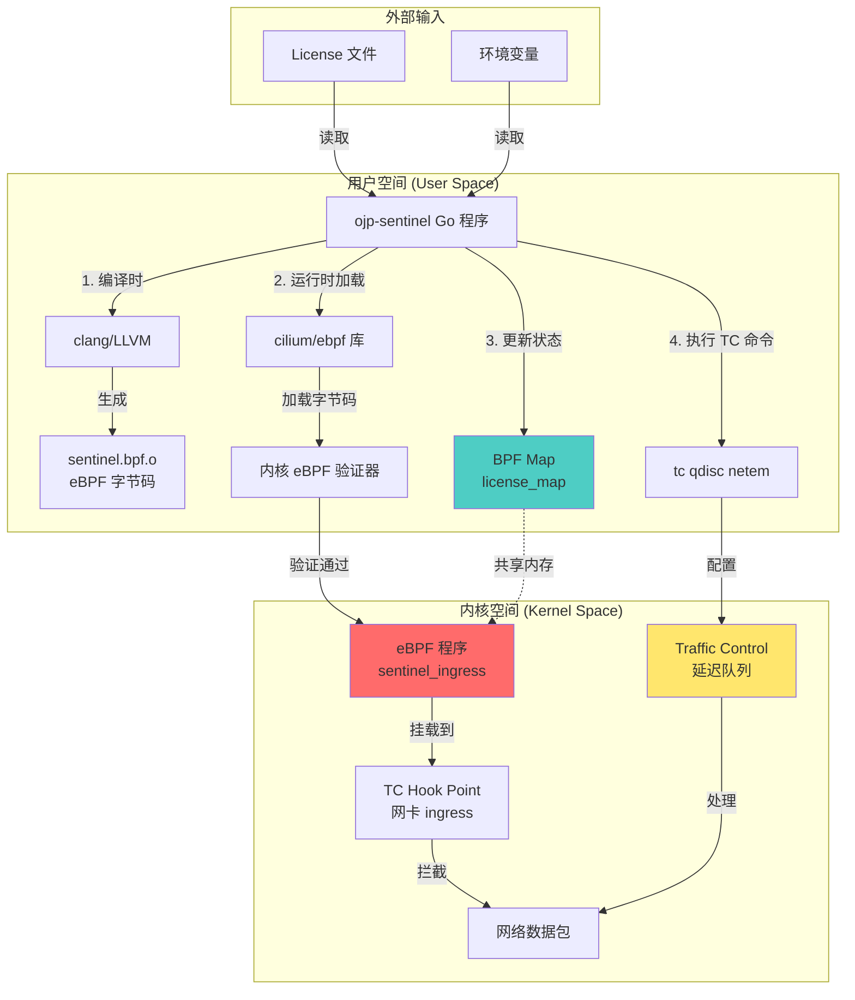
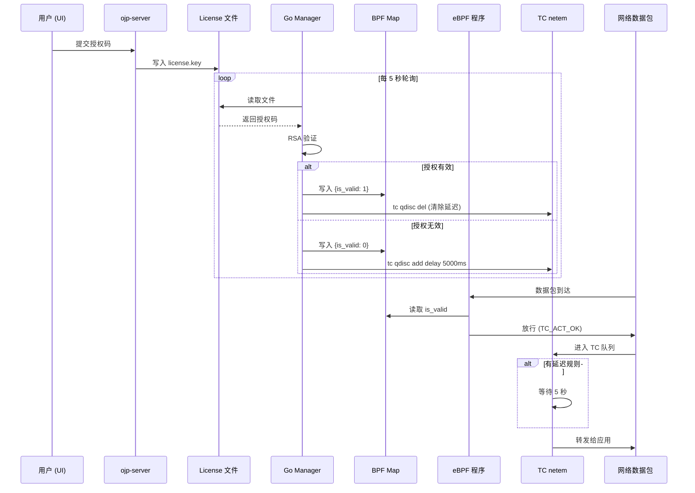

# OJP eBPF 授权哨兵 - 架构设计文档

## 一、整体架构概览



## 二、eBPF 模块加载机制

### 2.1 谁负责加载？

**答案：ojp-sentinel 容器中的 Go 程序**

加载流程分为两个阶段：

#### 阶段一：编译时（Dockerfile 构建）
```dockerfile
# 第一阶段：编译 eBPF C 代码为字节码
FROM debian:bookworm-slim as builder
RUN apt-get update && apt-get install -y clang llvm libbpf-dev

# 使用 clang 编译 C 代码为 eBPF 字节码
RUN clang -O2 -target bpf -c sentinel.bpf.c -o sentinel.bpf.o
```

**产物**：`sentinel.bpf.o` - 这是一个 ELF 格式的 eBPF 字节码文件

#### 阶段二：运行时（Go 程序启动）
```go
// 当前实现（简化版）
func main() {
    // 1. 读取并验证 License
    verifier := license.NewVerifier(publicKeyPEM)
    
    // 2. 根据 License 状态决定是否启用惩罚
    if !valid {
        applyPenalty(true)  // 启用 5s 延迟
    }
}

// 完整实现需要添加（TODO）
func loadeBPF() {
    // 使用 cilium/ebpf 库加载字节码
    spec, _ := ebpf.LoadCollectionSpec("sentinel.bpf.o")
    coll, _ := ebpf.NewCollection(spec)
    
    // 获取 eBPF 程序
    prog := coll.Programs["sentinel_ingress"]
    
    // 挂载到网卡的 TC ingress hook
    // tc filter add dev vethXXX ingress bpf obj sentinel.bpf.o
}
```

> **⚠️ 重要说明**：`cilium/ebpf` 只是一个 **Go 语言的 eBPF 操作库**，与 Cilium 网络方案**完全无关**！
> 
> - **库名称**：github.com/cilium/ebpf
> - **作用**：提供 Go 语言操作 eBPF 的 API（加载、卸载、读写 Map 等）
> - **网络要求**：**无特殊要求**，可以在任何 Docker 网络模式下使用（bridge、host、overlay 等）
> - **替代方案**：也可以使用 `libbpf-go`、`gobpf` 等其他库，或直接调用系统命令
>
> 这个库由 Cilium 项目团队开源，但它是一个**通用的 eBPF 工具库**，任何 Go 项目都可以使用。

### 2.2 加载到哪里？

eBPF 程序被加载到 **Linux 内核的 TC (Traffic Control) 子系统**：

```
网络数据包流向：
物理网卡 → TC ingress hook → eBPF 程序检查 → 应用程序
                    ↑
                    └─ sentinel_ingress() 在这里执行
```

### 2.3 为什么需要 privileged 权限？

```yaml
# docker-compose-sentinel.yml
ojp-sentinel:
  privileged: true        # 必需！
  network_mode: "host"    # 必需！
```

**原因**：
1. **加载 eBPF 程序**：需要 `CAP_BPF` 或 `CAP_SYS_ADMIN` 权限
2. **操作 TC**：需要 `CAP_NET_ADMIN` 权限
3. **访问宿主机网卡**：需要 `network_mode: host` 才能看到容器的 veth 网卡

## 三、工作原理详解

### 3.1 双层防护机制

我们采用了 **"eBPF 标记 + TC 延迟"** 的组合方案：

```
┌─────────────────────────────────────────────────────────┐
│  第一层：eBPF 程序（内核态，C 代码）                      │
│  作用：读取 BPF Map 中的授权状态                          │
│  位置：TC ingress hook                                   │
│  功能：可以进行精细的流量分类（当前简化为全部放行）        │
└─────────────────────────────────────────────────────────┘
                          ↓
┌─────────────────────────────────────────────────────────┐
│  第二层：TC netem（内核态，由 Go 配置）                   │
│  作用：对网卡应用延迟规则                                 │
│  命令：tc qdisc add dev vethXXX root netem delay 5000ms  │
│  效果：100% 的数据包都会被延迟 5 秒                       │
└─────────────────────────────────────────────────────────┘
```

### 3.2 为什么不在 eBPF 中直接延迟？

**技术限制**：
- eBPF 程序不能"睡眠"或"阻塞"，否则会导致内核死锁
- eBPF 的执行时间有严格限制（通常 < 1ms）
- 直接在 eBPF 中延迟会导致整个网络栈卡死

**解决方案**：
- eBPF 负责"标记"和"分类"
- TC netem 负责实际的"延迟"执行

### 3.3 数据流向



## 四、关键技术点

### 4.1 BPF Map（共享内存）

```c
// C 代码定义
struct {
    __uint(type, BPF_MAP_TYPE_HASH);
    __uint(max_entries, 1);
    __type(key, __u32);
    __type(value, struct license_config);
} license_map SEC(".maps");
```

**作用**：用户态（Go）和内核态（eBPF）之间的通信桥梁

**读写权限**：
- Go 程序：读写
- eBPF 程序：只读

### 4.2 TC (Traffic Control)

Linux 内核的流量控制子系统，支持：
- **qdisc（队列规则）**：控制数据包的排队和发送
- **netem（网络模拟）**：模拟延迟、丢包、乱序等网络状况

**我们的用法**：
```bash
# 启用 5 秒延迟
tc qdisc add dev veth123abc root netem delay 5000ms

# 清除延迟
tc qdisc del dev veth123abc root
```

### 4.3 容器网卡识别

每个 Docker 容器都有一对 veth（虚拟以太网）设备：
```
容器内: eth0
宿主机: veth123abc (随机生成的名称)
```

**哨兵的工作**：
1. 通过 Docker API 找到所有 `ojp-` 开头的容器
2. 获取它们的网络命名空间
3. 找到对应的 veth 设备名称
4. 在这些 veth 上应用 TC 规则

## 五、当前实现状态

### 已完成 ✅
- [x] eBPF C 代码编写（`sentinel.bpf.c`）
- [x] BPF Map 定义
- [x] Go License 验证逻辑
- [x] 文件监听机制
- [x] Dockerfile 多阶段构建

### 待完成 🚧
- [ ] 使用 `cilium/ebpf` 库加载 eBPF 字节码
- [ ] 实现 TC 命令执行（`tc qdisc add/del`）
- [ ] 容器网卡自动发现
- [ ] BPF Map 的实际读写

### 简化版本（当前）
当前代码是一个**概念验证版本**，主要展示了：
1. 授权验证逻辑 ✅
2. 文件监听机制 ✅
3. eBPF 代码结构 ✅

实际的延迟功能需要补全 TC 命令执行部分。

## 六、安全性分析

### 6.1 为什么难以绕过？

1. **内核级执行**：运行在 Ring 0，应用程序无法干预
2. **只读 Map**：eBPF 程序只能读取状态，不能被应用修改
3. **TC 规则持久化**：即使重启应用，延迟规则依然生效
4. **容器隔离**：在宿主机层面控制，容器内部无法感知

### 6.2 可能的绕过方式（及防御）

| 绕过方式 | 防御措施 |
|---------|---------|
| 修改 license.key 文件 | RSA 签名验证，私钥不公开 |
| 停止 ojp-sentinel 容器 | 使用 `restart: always` 策略 |
| 修改系统时间 | 使用 NTP 服务器校验（可选） |
| 直接操作 TC | 需要 root 权限，且哨兵会定期重新应用规则 |

## 七、性能影响

### 7.1 eBPF 程序性能
- **执行时间**：< 1 微秒
- **CPU 开销**：几乎可忽略（内核态执行）
- **内存占用**：< 1 MB

### 7.2 TC 延迟性能
- **授权有效时**：0 额外延迟
- **授权无效时**：固定 5 秒延迟（100% 命中）

## 八、部署要求

### 8.1 系统要求
- Linux 内核 >= 5.4（支持 eBPF）
- 安装 `tc` 工具（iproute2 包）
- Docker 环境

### 8.2 权限要求
```yaml
privileged: true
network_mode: "host"
volumes:
  - /lib/modules:/lib/modules:ro
  - /sys/kernel/debug:/sys/kernel/debug:rw
```

## 九、总结

**核心设计理念**：
> 将授权检查下沉到内核层，利用 Linux 原生的流量控制能力，实现应用层无法绕过的授权保护。

**技术栈**：
- **C (eBPF)**：内核态流量检查
- **Go**：用户态管理和编排
- **TC (netem)**：实际的延迟执行
- **Docker**：容器化部署

这是一个兼顾**安全性**、**性能**和**可维护性**的商业授权方案。
