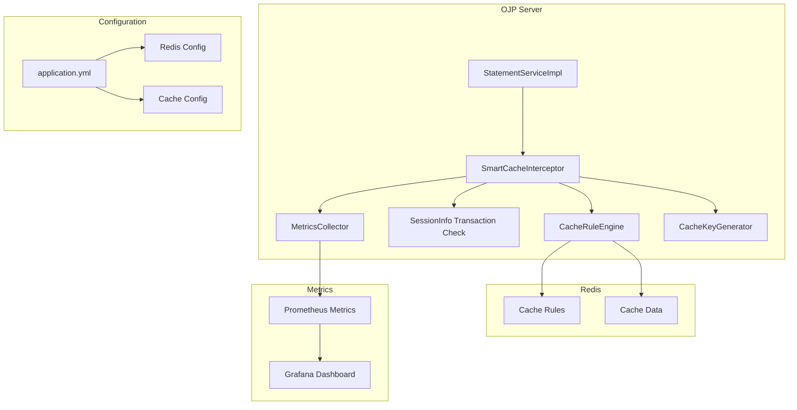
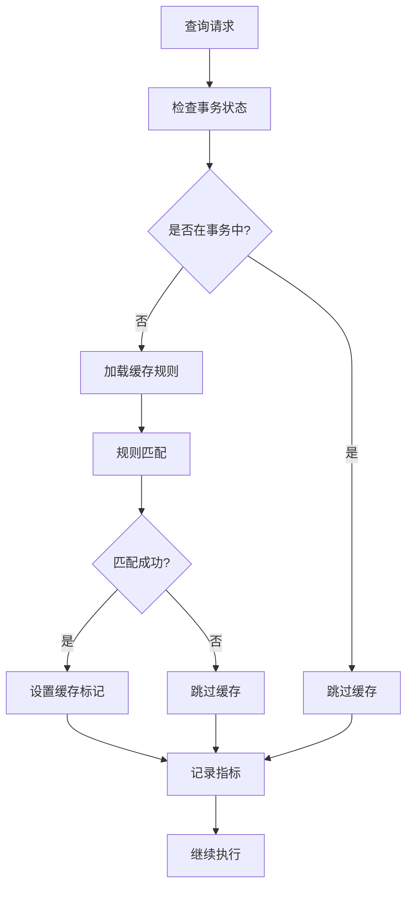

# OJP Server 智能缓存拦截器设计文档

## 📋 项目概述

本文档描述了 OJP Server 中智能缓存拦截器的设计实现，该拦截器基于 Redis 缓存规则引擎，参考 Smart Redis Cache 的设计理念，实现了智能的查询缓存功能。

## 🎯 核心目标

1. **基于 Redis 缓存规则引擎**：从 Redis 中读取缓存规则，动态计算当前查询 SQL 是否要走缓存服务
2. **智能缓存决策**：在拦截器上下文中记录缓存标记，为后续实现真实的 SQL 查询拦截到缓存服务做准备
3. **友好的指标数据**：参考 Smart Redis Cache 实现丰富的 metric 数据收集
4. **事务感知**：确保在事务中的查询不会被缓存，保证 ACID 特性

## 🏗️ 架构设计

### 整体架构图



### 核心组件

#### 1. SmartCacheInterceptor (主拦截器)
- **职责**：拦截 executeQuery 方法，进行缓存决策
- **位置**：`org.openjdbcproxy.grpc.server.interceptor.impl.SmartCacheInterceptor`
- **功能**：
  - 查询拦截和缓存决策
  - 直接从 sessionInfo 检查事务状态
  - 指标收集
  - 上下文属性设置

#### 2. CacheRuleEngine (缓存规则引擎)
- **职责**：从 Redis 加载缓存规则，进行规则匹配
- **功能**：
  - 从 Redis 读取缓存规则配置
  - 支持多种规则类型（表名、正则、查询类型、全局）
  - 按优先级排序和匹配规则
  - SQL 表名提取

#### 3. 事务状态检查
- **职责**：直接从 sessionInfo 检查事务状态
- **功能**：
  - 通过 `session.getTransactionInfo().getTransactionStatus()` 检查事务状态
  - 确保事务中的查询不被缓存
  - 无需额外状态跟踪，直接使用 gRPC 协议中的事务信息

#### 4. MetricsCollector (指标收集器)
- **职责**：收集和记录缓存相关指标
- **功能**：
  - 缓存命中/未命中/跳过统计
  - 事务操作统计
  - 查询执行统计
  - 缓存处理时间统计

#### 5. CacheKeyGenerator (缓存键生成器)
- **职责**：生成唯一的缓存键
- **功能**：
  - 基于连接哈希、SQL 哈希、参数哈希生成缓存键
  - 支持参数序列化
  - 缓存键格式：`ojp:cache:query:{connHash}:{sqlHash}:{paramsHash}`

## 🔧 实现细节

### 缓存规则类型

#### 1. 表名规则 (TABLE_NAME)
```java
{
  "name": "users_table_cache",
  "description": "缓存用户表查询",
  "type": "TABLE_NAME",
  "tables": ["users"],
  "ttl": "PT5M",
  "priority": 10,
  "enabled": true
}
```

#### 2. 正则表达式规则 (REGEX)
```java
{
  "name": "report_query_cache",
  "description": "缓存报告查询",
  "type": "REGEX",
  "regex": ".*report.*|.*analytics.*",
  "ttl": "PT1H",
  "priority": 5,
  "enabled": true
}
```

#### 3. 查询类型规则 (QUERY_TYPE)
```java
{
  "name": "select_only_cache",
  "description": "只缓存SELECT查询",
  "type": "QUERY_TYPE",
  "pattern": "SELECT",
  "ttl": "PT10M",
  "priority": 1,
  "enabled": true
}
```

#### 4. 全局规则 (GLOBAL)
```java
{
  "name": "global_cache",
  "description": "全局缓存规则",
  "type": "GLOBAL",
  "ttl": "PT30M",
  "priority": 0,
  "enabled": true
}
```

### 缓存决策流程



### 指标收集

#### Prometheus 指标
- `ojp.cache.hit` - 缓存命中计数
- `ojp.cache.miss` - 缓存未命中计数
- `ojp.cache.skip` - 缓存跳过计数
- `ojp.transaction.start` - 事务开始计数
- `ojp.transaction.commit` - 事务提交计数
- `ojp.transaction.rollback` - 事务回滚计数
- `ojp.query.execution` - 查询执行计数
- `ojp.query.error` - 查询错误计数
- `ojp.cache.processing.time` - 缓存处理时间

## 📊 配置说明

### Redis 配置
```yaml
ojp:
  redis:
    host: ${REDIS_HOST:localhost}
    port: ${REDIS_PORT:6379}
    database: ${REDIS_DATABASE:0}
    password: ${REDIS_PASSWORD:}
    username: ${REDIS_USERNAME:}
    timeout: ${REDIS_TIMEOUT:10000}
```

### 缓存规则存储
- **规则键**：`ojp:cache:rules`
- **版本键**：`ojp:cache:rules:version`
- **格式**：JSON 数组格式存储规则列表

## 🚀 API 接口

### 缓存规则管理 API

#### 1. 获取所有规则
```
GET /api/cache/rules
```

#### 2. 创建规则
```
POST /api/cache/rules
POST /api/cache/rules/table
POST /api/cache/rules/regex
POST /api/cache/rules/query-type
POST /api/cache/rules/global
```

#### 3. 更新规则
```
PUT /api/cache/rules/{name}
```

#### 4. 删除规则
```
DELETE /api/cache/rules/{name}
```

#### 5. 启用/禁用规则
```
PATCH /api/cache/rules/{name}/toggle
```

## 🔍 监控和调试

### 日志级别
- **DEBUG**：缓存决策详情
- **INFO**：规则加载和更新
- **WARN**：规则验证失败
- **ERROR**：Redis 连接失败

### 指标监控
- 通过 Prometheus 端点 `/metrics` 查看指标
- 支持 Grafana 大屏展示
- 可配置告警规则

## 📝 TODO 项

### 🔥 高优先级

1. **真实缓存服务实现**
   - [ ] 实现缓存存储服务（Redis/StarRocks）
   - [ ] 实现缓存查询服务
   - [ ] 实现缓存失效策略
   - [ ] 实现缓存预热机制

2. **SQL 解析优化**
   - [ ] 集成专业的 SQL 解析器（如 Druid SQL Parser）
   - [ ] 优化表名提取逻辑
   - [ ] 支持复杂 SQL 语句解析
   - [ ] 支持子查询和 CTE 解析

3. **缓存键策略优化**
   - [ ] 实现更智能的缓存键生成策略
   - [ ] 支持参数化查询的缓存键
   - [ ] 实现缓存键压缩
   - [ ] 支持缓存键版本管理

### 🟡 中优先级

4. **规则引擎增强**
   - [ ] 支持规则组合和嵌套
   - [ ] 实现规则热更新机制
   - [ ] 支持规则导入/导出
   - [ ] 实现规则版本管理

5. **性能优化**
   - [ ] 实现规则缓存机制
   - [ ] 优化 Redis 连接池配置
   - [ ] 实现批量规则加载
   - [ ] 支持规则预编译

6. **监控增强**
   - [ ] 实现缓存命中率统计
   - [ ] 支持缓存性能分析
   - [ ] 实现缓存容量监控
   - [ ] 支持缓存热点分析

### 🟢 低优先级

7. **用户体验优化**
   - [ ] 实现规则管理 Web UI
   - [ ] 支持规则模板
   - [ ] 实现规则推荐系统
   - [ ] 支持规则测试功能

8. **高级功能**
   - [ ] 支持分布式缓存
   - [ ] 实现缓存一致性保证
   - [ ] 支持缓存分区
   - [ ] 实现缓存备份和恢复

9. **安全增强**
   - [ ] 实现缓存访问控制
   - [ ] 支持敏感数据过滤
   - [ ] 实现缓存审计日志
   - [ ] 支持缓存加密

## 🔄 参考实现

### Smart Redis Cache 参考点

1. **规则引擎设计**：参考了 Smart Redis Cache 的规则匹配逻辑
2. **指标收集**：采用了类似的 Prometheus 指标设计
3. **缓存键生成**：参考了其缓存键策略
4. **事务感知**：借鉴了其事务安全机制

### 其他参考点

1. **Spring Cache**：参考了其注解驱动的缓存设计
2. **Hibernate Query Cache**：借鉴了其查询缓存机制
3. **Redis Cache**：参考了其缓存策略和配置

## 📈 性能考虑

### 优化策略
1. **规则缓存**：将规则缓存在内存中，减少 Redis 访问
2. **批量操作**：支持批量规则加载和更新
3. **异步处理**：缓存操作异步化，不影响查询性能
4. **连接池**：优化 Redis 连接池配置

### 性能指标
- 规则匹配时间 < 1ms
- 缓存键生成时间 < 0.5ms
- 指标收集开销 < 0.1ms
- 总体拦截器开销 < 2ms

## 🛡️ 安全考虑

1. **Redis 安全**：支持 Redis 认证和 SSL
2. **规则验证**：严格的规则格式验证
3. **SQL 注入防护**：安全的 SQL 解析
4. **访问控制**：API 访问权限控制

## 📚 相关文档

- [Smart Redis Cache 文档](https://github.com/redis/smart-cache)
- [OJP Server 架构文档](../documents/designs/architecture.md)
- [gRPC 拦截器文档](../documents/designs/grpc-interceptor.md)
- [监控指标文档](../documents/telemetry/README.md)
