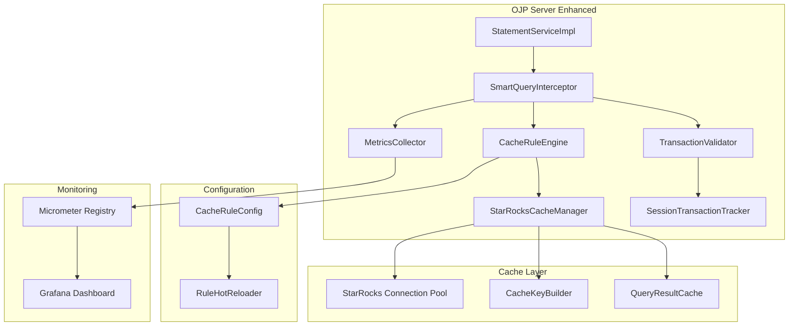

# OJP Server 智能缓存功能

## 概述

OJP Server 的智能缓存功能是参考 Redis Smart Cache 设计的查询缓存系统，它能够智能地拦截 JDBC 查询，根据配置的规则决定是否启用缓存，并将查询结果存储在 StarRocks 数据库中以提升后续查询性能。

## 核心特性

### 🚀 主要功能
- **智能查询拦截**：透明拦截 JDBC 查询，无需修改应用代码
- **事务感知**：支持事务状态检查，确保 ACID 特性不被破坏
- **灵活的规则引擎**：支持基于表名、SQL 模式、查询类型等多种缓存规则
- **StarRocks 集成**：使用 StarRocks 作为缓存存储，支持大规模数据缓存
- **指标监控**：提供丰富的监控指标，支持 Grafana 可视化
- **热配置更新**：支持运行时更新缓存规则，无需重启服务

### 🏗️ 架构特点
- **正交设计**：与现有 OJP 功能解耦，不影响原有功能
- **分层架构**：清晰的抽象层次，便于扩展和维护
- **高性能**：异步缓存存储，最小化对查询性能的影响
- **高可用**：缓存失效时自动降级到原始查询

## 架构设计



## 快速开始

### 1. 配置启用智能缓存

在 OJP Server 的配置文件中添加智能缓存配置：

```properties
# 启用智能缓存
smart.cache.enabled=true

# StarRocks 配置
smart.cache.starrocks.url=jdbc:mysql://localhost:9030/smart_cache
smart.cache.starrocks.username=root
smart.cache.starrocks.password=password
smart.cache.starrocks.driver=com.mysql.cj.jdbc.Driver
smart.cache.starrocks.pool.max=10
smart.cache.starrocks.pool.min=2

# 缓存配置
smart.cache.default.ttl=10m
smart.cache.max.ttl=24h
smart.cache.compression.enabled=true
smart.cache.metrics.enabled=true
smart.cache.transaction.aware=true

# 缓存键配置
smart.cache.key.prefix=ojp_cache
smart.cache.key.separator=:
smart.cache.key.strategy=QUERY_HASH_WITH_PARAMS
```

### 2. 配置缓存规则

创建缓存规则配置：

```java
// 创建智能缓存配置
SmartCacheConfig config = SmartCacheConfig.builder()
    .enabled(true)
    .starRocksConfig(starRocksConfig)
    .cacheRules(Arrays.asList(
        // 为用户表查询启用 5 分钟缓存
        CacheRuleConfigEntry.tableRule("users_cache", "users", Duration.ofMinutes(5)),
        
        // 为所有 SELECT 查询启用 10 分钟缓存
        CacheRuleConfigEntry.queryTypeRule("select_cache", QueryContext.QueryType.SELECT, Duration.ofMinutes(10)),
        
        // 启用事务感知规则（最高优先级）
        CacheRuleConfigEntry.transactionAwareRule(),
        
        // 使用正则表达式匹配特定查询模式
        CacheRuleConfigEntry.regexRule("report_cache", ".*report.*", Duration.ofHours(1))
    ))
    .build();

// 创建智能缓存管理器
SmartCacheManager cacheManager = new SmartCacheManager(config);
cacheManager.initialize();

// 集成到 StatementServiceImpl
StatementServiceImpl statementService = new StatementServiceImpl(
    sessionManager, 
    circuitBreaker, 
    serverConfiguration, 
    cacheManager
);
```

### 3. 启动服务

启动 OJP Server，智能缓存功能将自动生效。

## 配置详解

### 基础配置

| 配置项 | 类型 | 默认值 | 描述 |
|--------|------|--------|------|
| `smart.cache.enabled` | boolean | false | 是否启用智能缓存 |
| `smart.cache.compression.enabled` | boolean | true | 是否启用结果压缩 |
| `smart.cache.metrics.enabled` | boolean | true | 是否启用指标收集 |
| `smart.cache.transaction.aware` | boolean | true | 是否启用事务感知 |

### TTL 配置

| 配置项 | 类型 | 默认值 | 描述 |
|--------|------|--------|------|
| `smart.cache.default.ttl` | Duration | 10m | 默认缓存 TTL |
| `smart.cache.max.ttl` | Duration | 24h | 最大缓存 TTL |
| `smart.cache.cleanup.interval` | Duration | 1h | 清理过期缓存的间隔 |

### StarRocks 配置

| 配置项 | 类型 | 默认值 | 描述 |
|--------|------|--------|------|
| `smart.cache.starrocks.url` | String | - | StarRocks JDBC URL |
| `smart.cache.starrocks.username` | String | - | 用户名 |
| `smart.cache.starrocks.password` | String | - | 密码 |
| `smart.cache.starrocks.driver` | String | com.mysql.cj.jdbc.Driver | 驱动类名 |
| `smart.cache.starrocks.pool.max` | int | 10 | 最大连接池大小 |
| `smart.cache.starrocks.pool.min` | int | 2 | 最小连接池大小 |

## 缓存规则配置

### 规则类型

1. **表名规则**：基于表名匹配查询
2. **正则表达式规则**：基于 SQL 模式匹配
3. **查询类型规则**：基于查询类型（SELECT、INSERT 等）
4. **事务感知规则**：防止在事务中缓存不安全的查询
5. **默认规则**：兜底规则

### 规则配置示例

```java
// 1. 表名规则 - 为特定表启用缓存
CacheRuleConfigEntry tableRule = CacheRuleConfigEntry.builder()
    .name("users_table_cache")
    .description("缓存用户表查询")
    .type(CacheRuleConfigEntry.RuleType.TABLE_NAME)
    .pattern("users")
    .ttl(Duration.ofMinutes(5))
    .priority(10)
    .enabled(true)
    .build();

// 2. 正则表达式规则 - 为匹配模式的查询启用缓存
CacheRuleConfigEntry regexRule = CacheRuleConfigEntry.builder()
    .name("report_query_cache")
    .description("缓存报告查询")
    .type(CacheRuleConfigEntry.RuleType.REGEX)
    .pattern(".*report.*|.*analytics.*")
    .ttl(Duration.ofHours(1))
    .priority(5)
    .enabled(true)
    .build();

// 3. 查询类型规则 - 只缓存 SELECT 查询
CacheRuleConfigEntry selectRule = CacheRuleConfigEntry.builder()
    .name("select_only_cache")
    .description("只缓存SELECT查询")
    .type(CacheRuleConfigEntry.RuleType.QUERY_TYPE)
    .pattern("SELECT")
    .ttl(Duration.ofMinutes(10))
    .priority(1)
    .enabled(true)
    .build();

// 4. 事务感知规则 - 最高优先级，确保事务安全
CacheRuleConfigEntry transactionRule = CacheRuleConfigEntry.transactionAwareRule();
```

### 规则优先级

- 规则按优先级从高到低执行
- 事务感知规则通常设置为最高优先级 (Integer.MAX_VALUE)
- 默认规则设置为最低优先级 (-1)
- 相同优先级的规则按添加顺序执行

## 事务安全

智能缓存系统内置了事务感知机制，确保 ACID 特性：

### 安全策略

1. **写操作不缓存**：INSERT、UPDATE、DELETE 等写操作永不缓存
2. **事务中的读取**：如果事务已经执行了写操作，后续的读取不使用缓存
3. **事务隔离**：不同事务之间的缓存完全隔离
4. **自动降级**：缓存失效时自动降级到原始查询

### 事务状态跟踪

```java
// 事务开始时
smartCacheManager.getInterceptor().onTransactionStart(sessionId);

// 执行写操作时
smartCacheManager.getInterceptor().onWriteOperation(sessionId);

// 事务提交时
smartCacheManager.getInterceptor().onTransactionCommit(sessionId);

// 事务回滚时
smartCacheManager.getInterceptor().onTransactionRollback(sessionId);
```

## 监控指标

### 核心指标

| 指标名称 | 类型 | 描述 |
|----------|------|------|
| `ojp_cache_hits_total` | Counter | 缓存命中总数 |
| `ojp_cache_misses_total` | Counter | 缓存未命中总数 |
| `ojp_cache_skips_total` | Counter | 跳过缓存总数 |
| `ojp_cache_hit_ratio` | Gauge | 缓存命中率 |
| `ojp_cache_interception_time_avg_ms` | Gauge | 平均拦截耗时 |

### Grafana 面板配置

```json
{
  "dashboard": {
    "title": "OJP Smart Cache Metrics",
    "panels": [
      {
        "title": "Cache Hit Ratio",
        "type": "stat",
        "targets": [
          {
            "expr": "ojp_cache_hit_ratio",
            "format": "percentage"
          }
        ]
      },
      {
        "title": "Cache Operations",
        "type": "graph",
        "targets": [
          {
            "expr": "rate(ojp_cache_hits_total[5m])",
            "legend": "Hits"
          },
          {
            "expr": "rate(ojp_cache_misses_total[5m])",
            "legend": "Misses"
          },
          {
            "expr": "rate(ojp_cache_skips_total[5m])",
            "legend": "Skips"
          }
        ]
      }
    ]
  }
}
```

## 性能调优

### 缓存键策略

选择合适的缓存键生成策略：

- `QUERY_HASH_ONLY`：只基于 SQL 哈希，适合参数化查询少的场景
- `QUERY_HASH_WITH_PARAMS`：包含参数哈希，适合大多数场景（推荐）
- `TABLE_BASED`：基于表名，适合表级别的缓存控制
- `FULL_CONTEXT`：包含完整上下文，适合精细化缓存控制

### 连接池配置

根据负载调整 StarRocks 连接池：

```properties
# 高并发场景
smart.cache.starrocks.pool.max=50
smart.cache.starrocks.pool.min=10

# 低并发场景
smart.cache.starrocks.pool.max=10
smart.cache.starrocks.pool.min=2
```

### 内存优化

```properties
# 启用压缩以节省存储空间
smart.cache.compression.enabled=true

# 调整清理间隔
smart.cache.cleanup.interval=30m
```

## 故障排查

### 常见问题

1. **缓存未生效**
   - 检查 `smart.cache.enabled=true`
   - 确认规则配置正确
   - 查看日志中的规则匹配信息

2. **性能问题**
   - 检查 StarRocks 连接池配置
   - 监控缓存命中率
   - 检查缓存键冲突

3. **事务问题**
   - 确认事务感知规则已配置
   - 检查事务状态跟踪日志

### 调试日志

启用调试日志：

```properties
logging.level.org.openjdbcproxy.grpc.server.smartcache=DEBUG
```

### 健康检查

```java
// 检查缓存健康状态
SmartCacheManager.CacheHealthStatus health = cacheManager.getHealthStatus();
if (health.isHealthy()) {
    log.info("Smart cache is healthy: {}", health.getMessage());
} else {
    log.warn("Smart cache issues: {}", health.getMessage());
}
```

## 最佳实践

### 1. 规则设计原则
- 从具体到通用，高优先级到低优先级
- 事务感知规则放在最高优先级
- 避免过于宽泛的缓存规则

### 2. TTL 设置策略
- 频繁更新的数据：较短 TTL (1-5分钟)
- 相对稳定的数据：中等 TTL (10-60分钟)
- 静态数据：较长 TTL (1-24小时)

### 3. 监控策略
- 定期检查缓存命中率
- 监控缓存存储增长
- 关注拦截性能指标

### 4. 容量规划
- 根据查询频率估算缓存大小
- 定期清理过期缓存
- 监控 StarRocks 存储使用情况

## 扩展开发

### 自定义缓存规则

```java
public class CustomCacheRule extends AbstractCacheRule {
    
    public CustomCacheRule(Duration ttl) {
        super(enableCache(ttl));
    }
    
    @Override
    public Predicate<QueryContext> getCondition() {
        return ctx -> {
            // 自定义匹配逻辑
            return ctx.getSql().contains("custom_condition");
        };
    }
}
```

### 自定义指标收集

```java
public class CustomMetricsCollector implements SmartCacheMetrics {
    
    @Override
    public void recordCacheHit() {
        // 自定义指标收集逻辑
        customMetricRegistry.counter("custom.cache.hits").increment();
    }
    
    // 实现其他方法...
}
```

## 版本兼容性

| OJP Server 版本 | 智能缓存版本 | Java 版本 | StarRocks 版本 |
|-----------------|--------------|-----------|----------------|
| 1.0.x | 1.0.x | Java 17+ | 2.5+ |

## 许可证

本功能遵循与 OJP Server 相同的许可证协议。

---

如有问题或建议，请通过以下方式联系：
- GitHub Issues
- 技术支持邮箱
- 社区论坛